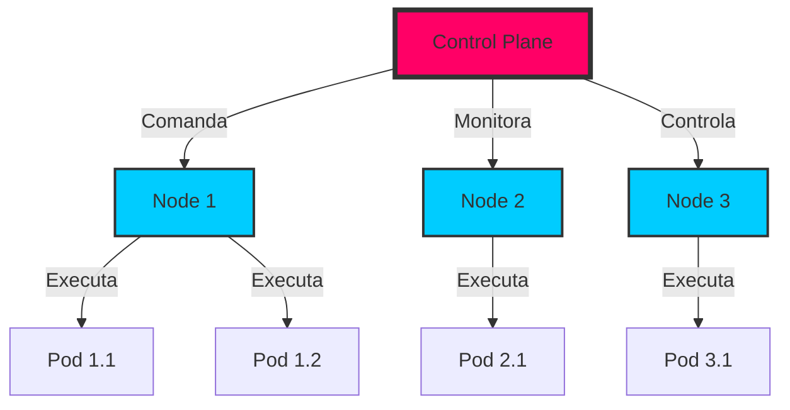
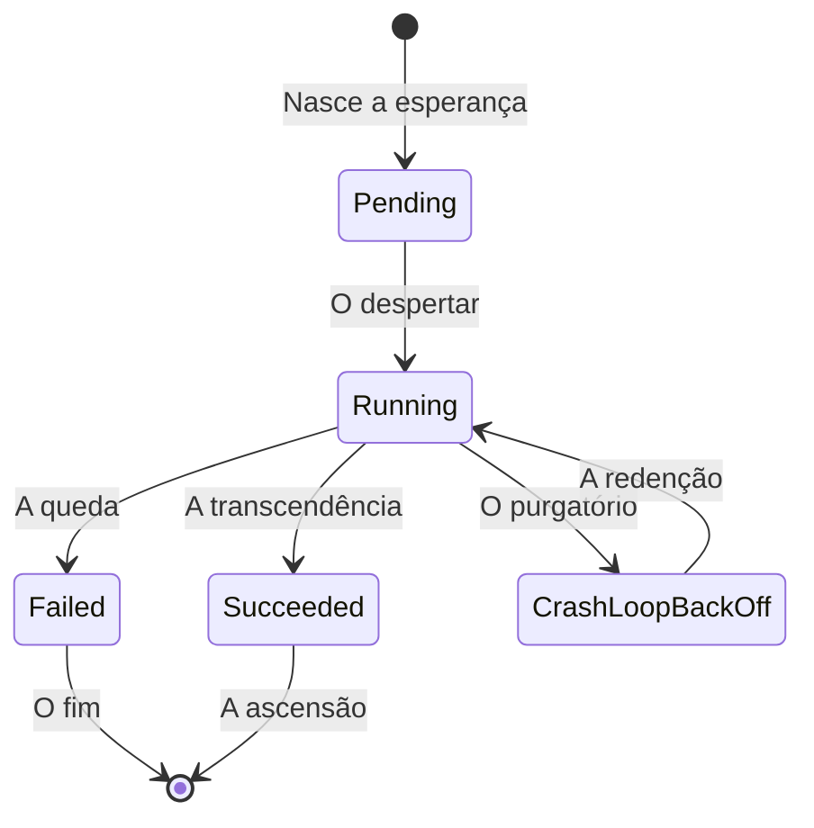
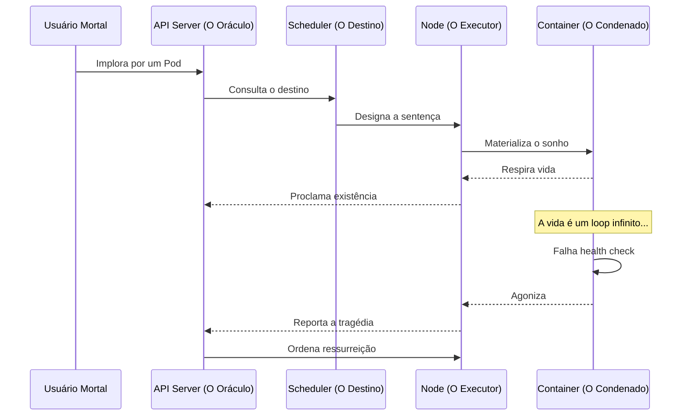

# Orquestração de Containers: A Sinfonia do Caos Digital

```ascii
╔══════════════════════════════════════════════════════════════════════════════╗
║  ORQUESTRAÇÃO: A SINFONIA DO CAOS                                           ║
║                                                                              ║
║  ┌─────┐  ┌─────┐  ┌─────┐     ╭─────────╮                                 ║
║  │Pod 1│──│Pod 2│──│Pod 3│────▶│Conductor│                                 ║
║  └─────┘  └─────┘  └─────┘     ╰─────────╯                                 ║
║     ▲        ▲        ▲            │                                        ║
║     └────────┴────────┴────────────┘                                        ║
║                                                                              ║
╚══════════════════════════════════════════════════════════════════════════════╝
```

Ah, caro leitor, adentre comigo este submundo digital onde containers dançam sua valsa efêmera, nascendo e morrendo como sonhos em uma noite de neón. Como num romance gótico-tech, onde cada microsserviço é um personagem em busca de seu propósito existencial, a orquestração emerge como o narrador onisciente, guiando destinos em meio ao caos dos datacenters.

## A Anatomia do Caos Controlado

Imagine, se puder, uma metrópole vertical onde cada container é um apartamento em um arranha-céu infinito. Sem a orquestração, teríamos o caos - containers brigando por recursos como moradores disputando o último pedaço de pizza no elevador.



### A Dança dos Containers

Como um baile de máscaras em uma festa corporativa distópica, cada container executa sua coreografia precisamente ensaiada. O load balancer, qual mestre de cerimônias cibernético, direciona o fluxo de requests como um DJ mixando batidas em uma rave underground.

```ascii
┌────────────────────────────────────────────────────┐
│    A VALSA DOS CONTAINERS                          │
│                                                    │
│    ┌────┐         ┌────┐         ┌────┐           │
│    │App1│◀────────│Load│─────────▶│App2│           │
│    └────┘         │Bal │         └────┘           │
│      ▲            └────┘           ▲              │
│      │               ▲             │              │
│      │               │             │              │
│    ┌────┐         ┌────┐         ┌────┐           │
│    │App3│◀────────│Cache│────────▶│App4│           │
│    └────┘         └────┘         └────┘           │
└────────────────────────────────────────────────────┘
```

## Conceitos Fundamentais

### Orquestração
Imagine uma sinfonia caótica, onde cada container é um músico rebelde tocando seu próprio instrumento. A orquestração é nosso maestro cibernético, transformando essa cacofonia digital em uma sinfonia harmônica. Como um controle de tráfego aéreo para seus microsserviços, só que com menos café e mais automação.

Em vez de ter DevOps insones monitorando dashboards intermináveis (embora isso ainda aconteça, não nos enganemos), a orquestração é nosso piloto automático em meio ao caos. É como ter um mordomo digital que:
- Ressuscita containers mortos como um necromante high-tech
- Equilibra carga como um malabarista quantum
- Escala aplicações mais rápido que fofocas em rede social
- Auto-cura como um Wolverine dos microsserviços

### Principais Orquestradores

Como num mercado negro de implantes cibernéticos, cada orquestrador tem sua especialidade:

- Kubernetes: O titã cromado, complexo como um romance russo, mas igualmente recompensador
- Docker Swarm: O irmão mais simples, para quando você não quer um doutorado só para fazer deploy
- Apache Mesos: O veterano de guerra, cicatrizes de batalhas corporativas incluídas
- Nomad: O infiltrado HashiCorp, minimalista como um apartamento japonês

## Kubernetes: O Leviatã Digital

Ah, Kubernetes! O leviatã dos mares digitais, onde cada tentáculo é um controller e cada escama um pod. Como um romance de Lovecraft reescrito em YAML, sua complexidade é tanto seu charme quanto sua maldição.

### O Ciclo de Vida: Uma Tragédia em Cinco Atos



Cada pod é um protagonista em sua própria novela existencial. Alguns vivem vidas longas e prósperas, servindo requests até o sunset de sua última replica. Outros, qual velas ao vento, apagam-se no primeiro sopro de um OOMKilled.

### A Hierarquia do Poder: Uma Distopia Corporativa

```ascii
╔════════════════════════════════════════════════════════╗
║ KUBERNETES HIERARCHY OF NEEDS                          ║
║                                                        ║
║                    ╭──────────╮                        ║
║                    │Control   │                        ║
║                    │Plane     │                        ║
║                    ╰──────────╯                        ║
║                         │                              ║
║          ┌──────────────┴──────────────┐              ║
║     ╭──────────╮                  ╭──────────╮        ║
║     │Master    │                  │Workers   │        ║
║     │Node      │                  │Nodes     │        ║
║     ╰──────────╯                  ╰──────────╯        ║
║          │                             │              ║
║    ┌─────┴─────┐               ┌──────┴──────┐       ║
║    │           │               │             │       ║
║ ╭──────╮  ╭──────╮         ╭──────╮     ╭──────╮    ║
║ │Pods  │  │Pods  │         │Pods  │     │Pods  │    ║
║ ╰──────╯  ╰──────╯         ╰──────╯     ╰──────╯    ║
╚════════════════════════════════════════════════════════╝
```

O Control Plane, qual CEO de uma megacorporação, comanda seu império de microsserviços do alto de sua torre de marfim. Os nodes, trabalhadores incansáveis, executam suas ordens sem questionar, enquanto pods nascem e morrem ao sabor dos deployments.

### A Coreografia do Caos



### Componentes Básicos
Como uma corporação megacapitalista distópica, K8s tem sua própria hierarquia:

- Control Plane: O conselho diretor do seu datacenter, tomando decisões que afetam a vida de milhares de containers
- Nodes: Trabalhadores incansáveis, como replicantes em uma linha de montagem digital
- Pods: Pequenos apartamentos compartilhados onde containers vivem em harmonia (ou não)
- Services: O sistema de metrô do seu cluster - conectando pods como estações em uma malha neon
- Deployments: Manifestos digitais que descrevem seu mundo ideal (que nunca existe exatamente como planejado)

### Arquitetura
- API Server: O cérebro do sistema, onde todas as decisões são tomadas
- Scheduler: O gerente de recursos, como um diretor de orquestra
- Controller Manager: O executivo, garantindo que tudo esteja no lugar certo
- etcd: O banco de dados, armazenando o estado do cluster
- kubelet: O agente de cada nó, como um agente de segurança
- kube-proxy: O roteador, como um detetive de tráfego

## Docker Swarm: A Colmeia Digital

Enquanto Kubernetes é o leviatã dos mares profundos, Swarm é a colmeia no jardim dos fundos - menor, mais simples, mas não menos fascinante em sua complexidade organizada.

```ascii
╔═══════════════════════════════════════════════════════╗
║ SWARM ARCHITECTURE                                    ║
║                                                       ║
║    Manager Nodes                                      ║
║  ┌────┐  ┌────┐  ┌────┐                              ║
║  │Lead│──│Mgr │──│Mgr │                              ║
║  └────┘  └────┘  └────┘                              ║
║     │       │       │                                 ║
║     └───────┴───────┴───────────────┐                ║
║                                     ▼                 ║
║  Worker Nodes                                        ║
║  ┌────┐  ┌────┐  ┌────┐  ┌────┐  ┌────┐             ║
║  │Wrk1│──│Wrk2│──│Wrk3│──│Wrk4│──│Wrk5│             ║
║  └────┘  └────┘  └────┘  └────┘  └────┘             ║
╚═══════════════════════════════════════════════════════╝
```

### Conceitos Básicos
- Nodes
- Services
- Tasks
- Stacks

### Comandos Essenciais
```bash
# Inicializar swarm
docker swarm init

# Criar serviço
docker service create --name web nginx

# Escalar serviço
docker service scale web=3
```

## Comparativo de Orquestradores

### Kubernetes vs Swarm
| Aspecto | Kubernetes | Swarm |
|---------|------------|-------|
| Complexidade | Alta | Baixa |
| Escalabilidade | Muito Alta | Moderada |
| Curva de Aprendizado | Íngreme | Suave |
| Recursos | Abundantes | Básicos |

## Melhores Práticas

### Planejamento
- Arquitetura distribuída
- Estratégia de deployment
- Política de recursos
- Monitoramento

### Segurança
- RBAC
- Network Policies
- Secrets Management
- Container Security

## Troubleshooting

### Problemas Comuns
- Node failures
- Network issues
- Resource constraints
- Configuration errors

### Ferramentas de Debug
- Logs centralizados
- Métricas
- Tracing
- Health checks

