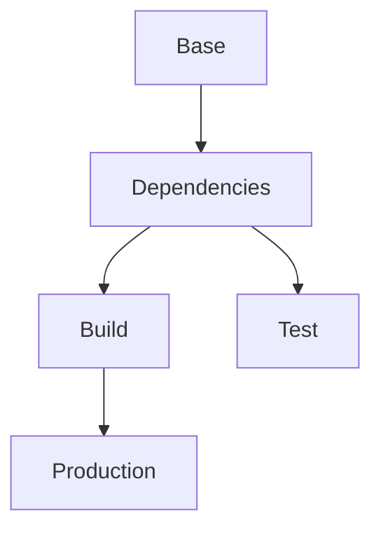

# Docker Multi-stage Builds 🏗️

## Basic Concepts 📚

### What are Multi-stage Builds?
Multi-stage builds permitem otimizar Dockerfiles criando imagens intermediárias durante o processo de build. Isso resulta em imagens finais menores e mais seguras.

### Benefits
1. ✅ Imagens menores
2. ✅ Separação de concerns
3. ✅ Segurança melhorada
4. ✅ Build process otimizado
5. ✅ Menos dependências na imagem final

## Basic Examples 🔨

### Node.js Application
```dockerfile
# Build stage
FROM node:18-alpine AS builder
WORKDIR /app
COPY package*.json ./
RUN npm ci
COPY . .
RUN npm run build

# Production stage
FROM node:18-alpine
WORKDIR /app
COPY --from=builder /app/dist ./dist
COPY package*.json ./
RUN npm ci --only=production
CMD ["node", "dist/main.js"]
```

### Go Application
```dockerfile
# Build stage
FROM golang:1.19-alpine AS builder
WORKDIR /app
COPY go.* ./
RUN go mod download
COPY . .
RUN CGO_ENABLED=0 go build -o app

# Production stage
FROM alpine:3.18
RUN apk add --no-cache ca-certificates
COPY --from=builder /app/app /usr/local/bin/
CMD ["app"]
```

## Advanced Patterns 🎯

### Multiple Build Stages
```dockerfile
# Dependencies stage
FROM node:18-alpine AS deps
WORKDIR /app
COPY package*.json ./
RUN npm ci

# Test stage
FROM deps AS tester
COPY . .
RUN npm run test

# Build stage
FROM deps AS builder
COPY . .
RUN npm run build

# Production stage
FROM node:18-alpine
COPY --from=builder /app/dist ./dist
CMD ["node", "dist/main.js"]
```

### Parallel Builds
```dockerfile
# Frontend build
FROM node:18-alpine AS frontend-builder
WORKDIR /app
COPY frontend/package*.json ./
RUN npm ci
COPY frontend/ .
RUN npm run build

# Backend build
FROM golang:1.19-alpine AS backend-builder
WORKDIR /app
COPY backend/go.* ./
RUN go mod download
COPY backend/ .
RUN CGO_ENABLED=0 go build -o api

# Final stage
FROM alpine:3.18
RUN apk add --no-cache ca-certificates nginx
COPY --from=frontend-builder /app/dist /usr/share/nginx/html
COPY --from=backend-builder /app/api /usr/local/bin/
COPY nginx.conf /etc/nginx/conf.d/default.conf
CMD ["nginx", "-g", "daemon off;"]
```

## Optimization Techniques ⚡

### Cache Optimization
```dockerfile
# Dependencies with cache
FROM node:18-alpine AS deps
WORKDIR /app
COPY package*.json ./
RUN --mount=type=cache,target=/root/.npm \
    npm ci

# Build with cache
FROM deps AS builder
COPY . .
RUN --mount=type=cache,target=/root/.npm \
    npm run build

# Production
FROM node:18-alpine
COPY --from=builder /app/dist ./dist
CMD ["node", "dist/main.js"]
```

### Selective Copy
```dockerfile
# Build stage
FROM golang:1.19 AS builder
WORKDIR /app
COPY . .
RUN go build -o app

# Production stage
FROM alpine:3.18
# Copiar apenas binários necessários
COPY --from=builder /app/app /usr/local/bin/
COPY --from=builder /app/configs ./configs
# Ignorar arquivos desnecessários
```

## Development vs Production 🔄

### Development Mode
```dockerfile
# Base stage
FROM node:18-alpine AS base
WORKDIR /app
COPY package*.json ./
RUN npm ci

# Development stage
FROM base AS development
COPY . .
CMD ["npm", "run", "dev"]

# Production build
FROM base AS builder
COPY . .
RUN npm run build

# Production stage
FROM node:18-alpine
COPY --from=builder /app/dist ./dist
CMD ["node", "dist/main.js"]
```

## Best Practices ✅

### DO's
1. [x] Use stages específicos para cada fase
2. [x] Otimize ordem das camadas
3. [x] Utilize cache eficientemente
4. [x] Copie apenas arquivos necessários
5. [x] Mantenha imagem base consistente

### DON'Ts
1. [ ] Misturar concerns em um único stage
2. [ ] Copiar arquivos desnecessários
3. [ ] Ignorar segurança
4. [ ] Duplicar dependências
5. [ ] Esquecer de otimizar camadas

## Security Considerations 🔒

### Minimal Base Images
```dockerfile
# Build stage
FROM node:18-alpine AS builder
WORKDIR /app
COPY . .
RUN npm ci && npm run build

# Secure production stage
FROM node:18-alpine
# Criar usuário não-root
RUN addgroup -S appgroup && \
    adduser -S appuser -G appgroup
USER appuser
COPY --from=builder /app/dist ./dist
CMD ["node", "dist/main.js"]
```

## Debugging Tips 🔍

### Debug Stage
```dockerfile
# Debug stage
FROM builder AS debug
RUN apk add --no-cache curl htop
CMD ["sh"]

# Build com debug
docker build --target debug .
```

## Waifu Build Tips 💫

> **Build-chan diz:** "Multi-stage é como fazer um bento box - cada ingrediente tem seu lugar!"
{style="tip"}

> **Security-sama alerta:** "Mantenha sua imagem final leve e segura!"
{style="warning"}

## Quick Reference 📚

### Common Commands
```bash
# Build específico stage
docker build --target builder .

# Build com args
docker build \
  --build-arg NODE_ENV=production \
  --target production .

# Debug build
docker build --progress=plain .
```

### Stage Dependencies


> **Build Master's Note:** "O melhor multi-stage build é aquele que equilibra eficiência e manutenibilidade."
{style="note"}